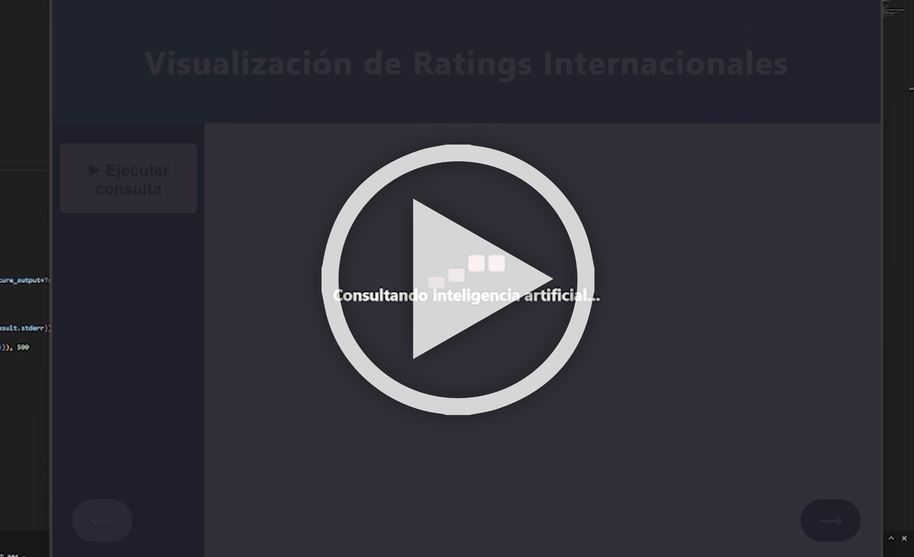

# Análisis cualitativo de entidades financieras con I.A. [Demo]

El programa toma un <i>pool</i> de entidades financieras y aplica sobre ellas un escaneo en web, mediante el uso de API de OpenAI. La información recabada es recopilada y analizada para generar un informe que incluye una calificación ponderada sobre distintos rubros de orden cualitativo.

---

## Instrucciones:

<b>Importante:</b> Para que funcione, es necesario que cambies la variable "CLAVE_DE_FER" del archivo main.py por una <a href="https://openai.com/en/index/openai-api/" target="_blank" rel="noopener noreferrer">clave API</a> válida de OpenAI.

• Descargar o clonar

• [Opcional] Modificar el contenido de los ficheros Emisores.txt y c.prompt.

• Ejecutar app.py

---

## Video demostración:

